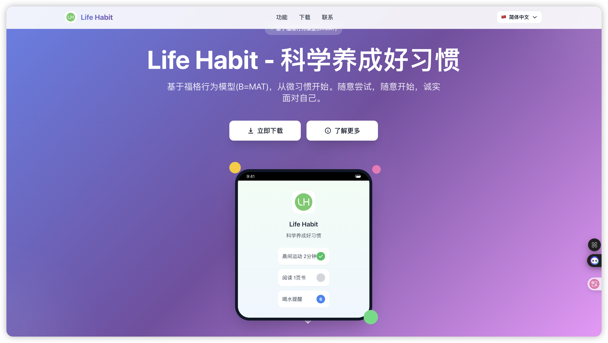
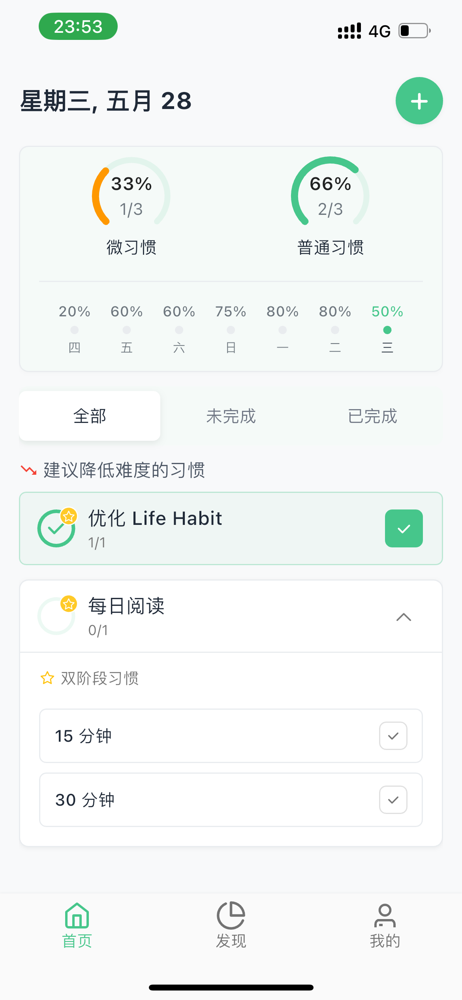
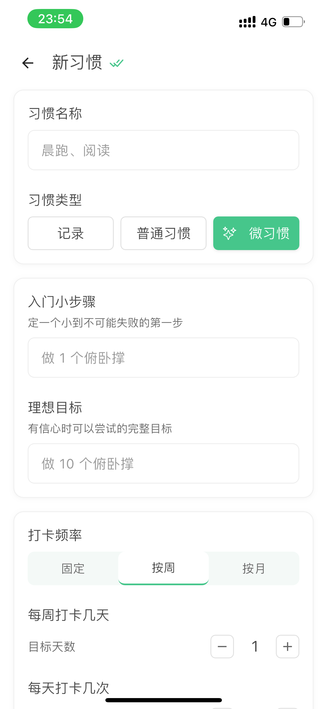
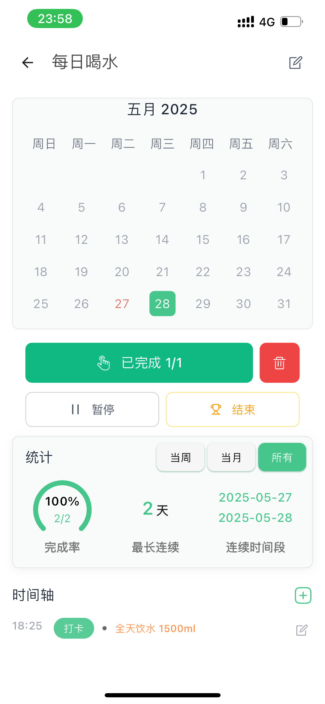
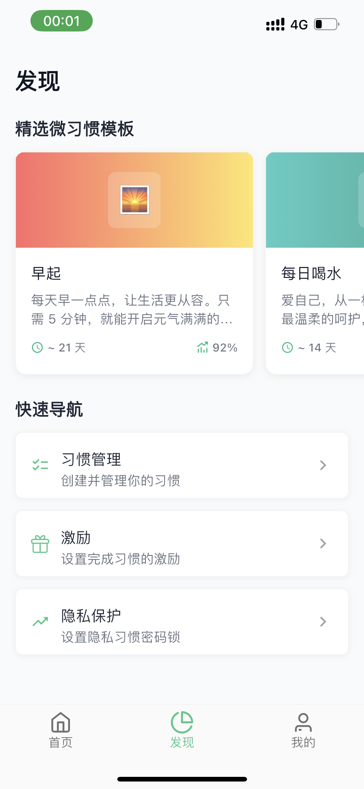
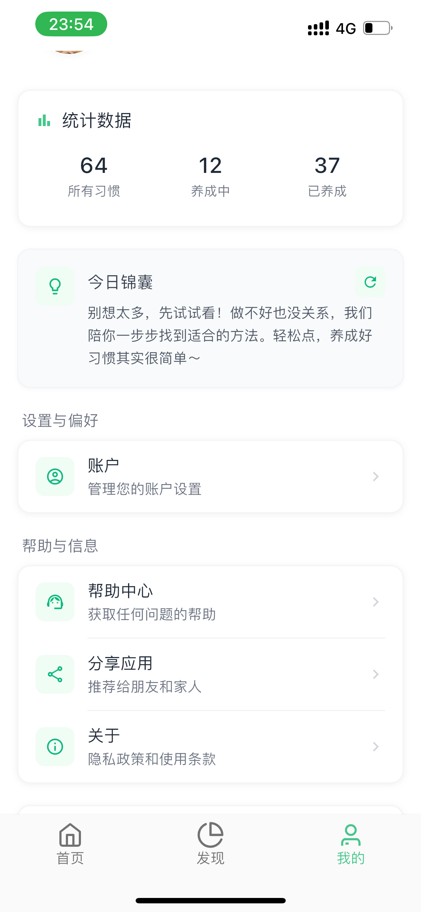

<div align="center">

# LifeHabit - 微习惯养成助手
### 🌱 科学的习惯养成助手

[](https://apps.apple.com/app/id6473467524)
[](https://play.google.com/store/apps/details?id=com.dxwvv.LifeHabit)
[](https://storage.dxwvv.com/dxwvv-web/LifeHabitApp.apk)
[](https://dxwvv.com/zh-cn)

**语言**: 中文 | [English](README_EN.md)  
**用户手册**: [📖 中文指南](USER_MANUAL.md) | [📖 English Guide](USER_MANUAL_EN.md)



</div>

---

## 🌟 简介

LifeHabit 是一款基于科学行为设计理论的习惯养成应用，帮助您轻松培养良好的生活习惯。我们的核心理念是"从小开始，持续进步"，通过微习惯系统让习惯养成变得简单而有效。

---

## 🎨 产品亮点展示

<div align="center">

<table>
<tr>
<td align="center" width="25%">
<div style="padding: 20px; background: linear-gradient(135deg, #667eea 0%, #764ba2 100%); border-radius: 15px; color: white;">
<h3>🎯</h3>
<h4>微习惯系统</h4>
<p>从1%开始<br/>循序渐进</p>
</div>
</td>
<td align="center" width="25%">
<div style="padding: 20px; background: linear-gradient(135deg, #f093fb 0%, #f5576c 100%); border-radius: 15px; color: white;">
<h3>📊</h3>
<h4>数据可视化</h4>
<p>进步一目了然<br/>成就感满满</p>
</div>
</td>
<td align="center" width="25%">
<div style="padding: 20px; background: linear-gradient(135deg, #4facfe 0%, #00f2fe 100%); border-radius: 15px; color: white;">
<h3>🎮</h3>
<h4>游戏化激励</h4>
<p>打卡获得奖励<br/>坚持更有趣</p>
</div>
</td>
<td align="center" width="25%">
<div style="padding: 20px; background: linear-gradient(135deg, #43e97b 0%, #38f9d7 100%); border-radius: 15px; color: white;">
<h3>🔔</h3>
<h4>智能提醒</h4>
<p>科学提醒算法<br/>不打扰日常</p>
</div>
</td>
</tr>
</table>

<br>

### ✨ **为什么选择 LifeHabit？**

<table>
<tr>
<td align="center" width="33%">
<h3>🧠 科学原理</h3>
<p>基于行为心理学的<strong>福格行为模型</strong><br/>
让习惯养成更加科学有效</p>
</td>
<td align="center" width="33%">
<h3>📈 持续更新</h3>
<p>团队持续优化迭代<br/>
用户反馈驱动产品进步</p>
</td>
</tr>
</table>

</div>

---

## ✨ 核心特色

### 🎯 **两阶段微习惯系统**

- **第一阶段**：设置极其简单、100%可完成的目标
- **第二阶段**：在舒适区内逐步增加难度

### 📊 **数据驱动的习惯构建**

- 从时间、持续时长、频率三个维度追踪习惯
- 智能数据分析帮助您找到最优目标设置
- 基于真实表现数据逐步调整习惯难度

### 🎮 **激励系统**

- 为自己设置奖励
- 精美分享图让每一个进步都值得庆祝

### 🔔 **智能提醒系统**

- 多种提醒方式，不给偷懒找借口
- 桌面小组件：打卡、奖励、统计一应俱全
- 每日锦囊：基于科学指导的温暖鼓励

---

## 📱 应用截图

<div align="center">

### 🚀 使用流程一览

<table>
<tr>
<td align="center" width="50%">
<h4>🏠 主界面</h4>

<p><em>清爽简洁的主界面，一目了然的习惯进度</em></p>
</td>
<td align="center" width="50%">
<h4>➕ 创建习惯</h4>

<p><em>轻松创建新习惯，多种类型任你选择</em></p>
</td>
</tr>
</table>

<div style="text-align: center; margin: 20px 0;">
<h3>⬇️ 开始习惯养成之旅 ⬇️</h3>
</div>

<table>
<tr>
<td align="center" width="50%">
<h4>📊 习惯详情</h4>

<p><em>详细的数据统计，让进步看得见</em></p>
</td>
<td align="center" width="50%">
<h4>🎁 奖励系统</h4>

<p><em>游戏化激励机制，让坚持更有动力</em></p>
</td>
</tr>
</table>

<div style="text-align: center; margin: 20px 0;">
<h3>🔄 持续优化体验 🔄</h3>
</div>

<table>
<tr>
<td align="center" width="50%">
<h4>🔍 发现页面</h4>

<p><em>海量习惯模板，发现更多可能</em></p>
</td>
<td align="center" width="50%">
<h4>👤 个人中心</h4>

<p><em>个性化设置，打造专属体验</em></p>
</td>
</tr>
</table>

<br>

### 💡 **核心特色流程**

```
                    🌟 LifeHabit 习惯养成流程 🌟
                              
    🎯 选择目标 ────→ 📝 创建习惯 ────→ ⏰ 设置提醒
         │                                     │
         │                                     ↓
    🔄 持续优化 ←──── 🎁 获得奖励 ←──── ✅ 开始打卡
         │                                     │
         │                                     ↓
    📊 数据分析 ←─────────────────────── 📈 查看进度
                              
    ┌─────────────────────────────────────────────────┐
    │  💪 每日坚持 → 📊 数据积累 → 🎯 目标达成 → 🏆 习惯养成  │
    └─────────────────────────────────────────────────┘
```

<h3>📈 从小习惯到大改变的完整旅程</h3>
<p>🌱 <strong>微习惯</strong> → 📊 <strong>数据追踪</strong> → 🎮 <strong>游戏化激励</strong> → 🏆 <strong>习惯养成</strong></p>

</div>

---

## 📊 用户数据一览

<div align="center">

<table>
<tr>
<td align="center" width="25%">
<h2>🎯</h2>
<h3><strong>500+</strong></h3>
<p>全球下载量</p>
</td>
<td align="center" width="25%">
<h2>⭐</h2>
<h3><strong>4.6/5.0</strong></h3>
<p>App Store 评分</p>
</td>
<td align="center" width="25%">
<h2>👥</h2>
<h3><strong>95%</strong></h3>
<p>用户留存率</p>
</td>
<td align="center" width="25%">
<h2>📈</h2>
<h3><strong>21天</strong></h3>
<p>平均习惯养成周期</p>
</td>
</tr>
</table>

<br>

### 💬 **真实用户反馈**

<table>
<tr>
<td align="center" width="50%">
<blockquote>
<p><em>"界面设计太棒了！每次打卡都有成就感，现在已经坚持跑步30天了！"</em></p>
<cite>— 小明，北京用户</cite>
</blockquote>
</td>
<td align="center" width="50%">
<blockquote>
<p><em>"微习惯系统真的很科学，从每天1个俯卧撑开始，现在能做100个了！"</em></p>
<cite>— 阿强，上海用户</cite>
</blockquote>
</td>
</tr>
</table>

</div>

---

## 🏆 用户评价

> **"这才是猛男该用的 App 🐶"** - 莱森 LysonOber  
> "太萌了！天使降临我身边 👼 很喜欢这种打卡获取能量的正反馈。"

> **4.6/5.0** ⭐⭐⭐⭐⭐ - App Store评分

---

## 🚀 立即下载

<div align="center">

### 📱 移动端下载

<table>
<tr>
<td align="center">
<h3>📱 iOS</h3>
<a href="https://apps.apple.com/app/id6473467524">

</a>
<br>
<code>习惯点点-日常打卡记录与提醒</code>
</td>
<td align="center">
<h3>🤖 Android</h3>
<a href="https://play.google.com/store/apps/details?id=com.dxwvv.LifeHabit">

</a>
<br>
<code>LifeHabit - Tiny Habit Builder</code>
</td>
</tr>
<tr>
<td align="center">
<h3>📦 APK直下</h3>
<a href="https://storage.dxwvv.com/dxwvv-web/LifeHabitApp.apk">

</a>
<br>
<code>适用于Android设备</code>
</td>
<td align="center">
<h3>🌐 官网</h3>
<a href="https://dxwvv.com/zh-cn">

</a>
<br>
<code>更多信息与支持</code>
</td>
</tr>
</table>

</div>

---

## 🛠️ 技术特色

- 🎯 **无限习惯追踪**
- 📊 **三维数据分析**
- 🔄 **智能算法优化**
- 📱 **跨平台同步**
- 🔒 **数据安全保护**
- 🎨 **精美UI设计**

---

## 📞 联系我们

<div align="center">

| 联系方式 | 信息 |
|:---:|:---:|
| 📧 **客服邮箱** | support@dxwvv.com |
| 🌐 **官方网站** | [dxwvv.com](https://dxwvv.com/zh-cn) |

</div>

---

## 📄 法律信息

- [🔒 隐私政策](https://habitdots.com/privacy_policy.html)
- [📋 用户协议](https://habitdots.com/user_policy.html#%E8%87%AA%E5%8A%A8%E7%BB%AD%E8%B4%B9)

---

<div align="center">

## ⭐ 如果这个项目对你有帮助，请给一个star！

**让我们一起养成好习惯，遇见更好的自己！**

---

### 🎯 开始你的习惯养成之旅

[](https://apps.apple.com/app/id6473467524)

---

*Made with ❤️ by LifeHabit Team*  
*Copyright © 2023-2025 LifeHabit. All rights reserved.*

</div> 
