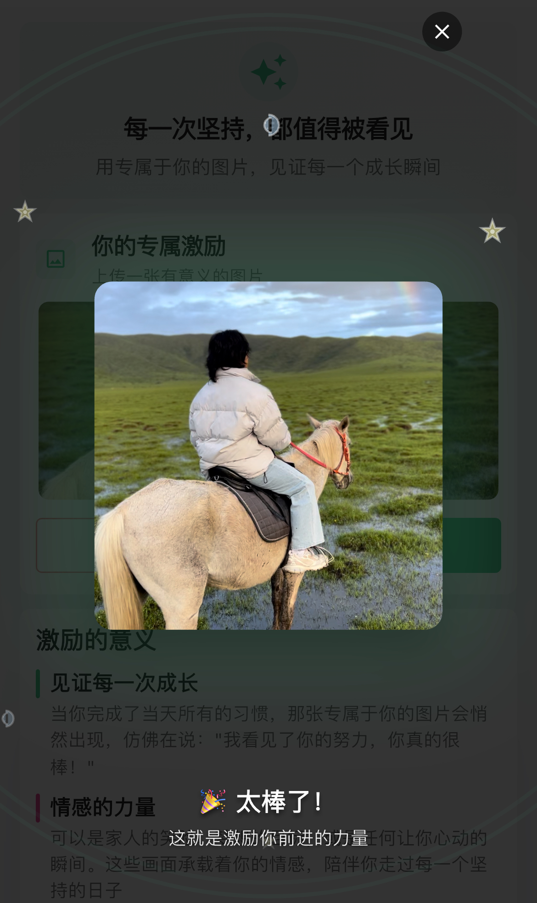

# LifeHabit - 微习惯养成助手
### 🌱 科学的习惯养成助手

**语言**: 中文 | [English](README_EN.md)  
**用户手册**: [📖 中文指南](USER_MANUAL.md) | [📖 English Guide](USER_MANUAL_EN.md)

---

## 🌟 简介

LifeHabit 是一款基于科学行为设计理论的习惯养成应用，帮助您轻松培养良好的生活习惯。我们的核心理念是"从小开始，持续进步"，通过微习惯系统让习惯养成变得简单而有效。

---

## ✨ 核心特色

### 🎯 **两阶段微习惯系统**

- **第一阶段**：设置极其简单、100%可完成的目标
- **第二阶段**：在舒适区内逐步增加难度

### 📊 **数据驱动的习惯构建**

- 从时间、持续时长、频率三个维度追踪习惯
- 智能数据分析帮助您找到最优目标设置
- 基于真实表现数据逐步调整习惯难度

### 🎮 **游戏化激励系统**

- 为自己设置奖励，用打卡获得能量兑换
- 超过70枚原创手绘打卡图标
- 精美分享图让每一个进步都值得庆祝

### 🔔 **智能提醒系统**

- 多种提醒方式，不给偷懒找借口
- 桌面小组件：打卡、奖励、统计一应俱全
- 每日锦囊：基于科学指导的温暖鼓励

---

## 📱 应用截图

### 主界面

### 创建习惯

### 习惯详情

### 发现页面

### 个人中心

### 奖励系统

---

## 🏆 用户评价

> **"这才是猛男该用的 App 🐶"** - 莱森 LysonOber  
> "太萌了！天使降临我身边 👼 很喜欢这种打卡获取能量的正反馈。"

> **4.6/5.0** ⭐⭐⭐⭐⭐ - App Store评分

---

## 🚀 立即下载

### 📱 移动端下载

<table>
<tr>
<td align="center">
<h3>📱 iOS</h3>

 
<code>习惯点点-日常打卡记录与提醒</code>
</td>
<td align="center">
<h3>🤖 Android</h3>

 
<code>LifeHabit - Tiny Habit Builder</code>
</td>
</tr>
<tr>
<td align="center">
<h3>📦 APK直下</h3>

 
<code>适用于Android设备</code>
</td>
<td align="center">
<h3>🌐 官网</h3>

 
<code>更多信息与支持</code>
</td>
</tr>
</table>

---

## 💎 会员功能

### 💰 **灵活的订阅选择**

- 🌙 **月会员** - ¥9 (≈ 2瓶饮料)
- 🍃 **季会员** - ¥18 (≈ 1杯奶茶) 
- ⭐ **年会员** - ¥36 (≈ 1杯咖啡)
- 💎 **终身会员** - ¥99 (终身精进之选)

### 🔓 **解锁功能**

- ♾️ 无限习惯数量
- 🎁 无限奖励设置
- 🎨 全部原创图标
- 📱 全部小组件样式
- ☁️ iCloud数据备份
- 🚀 更多PRO功能

---

## 🛠️ 技术特色

- 🎯 **无限习惯追踪**
- 📊 **三维数据分析**
- 🔄 **智能算法优化**
- 📱 **跨平台同步**
- 🔒 **数据安全保护**
- 🎨 **精美UI设计**

---

## 📞 联系我们

| 联系方式 | 信息 |
|:---:|:---:|
| 📧 **客服邮箱** | support@dxwvv.com |
| 🌐 **官方网站** | [dxwvv.com](https://dxwvv.com/zh-cn) |

---

## 📄 法律信息

- [🔒 隐私政策](https://habitdots.com/privacy_policy.html)
- [📋 用户协议](https://habitdots.com/user_policy.html#%E8%87%AA%E5%8A%A8%E7%BB%AD%E8%B4%B9)

---

## ⭐ 如果这个项目对你有帮助，请给一个star！

**让我们一起养成好习惯，遇见更好的自己！**

---

### 🎯 开始你的习惯养成之旅

---

*Made with ❤️ by LifeHabit Team*  
*Copyright © 2023-2025 LifeHabit. All rights reserved.*

 
