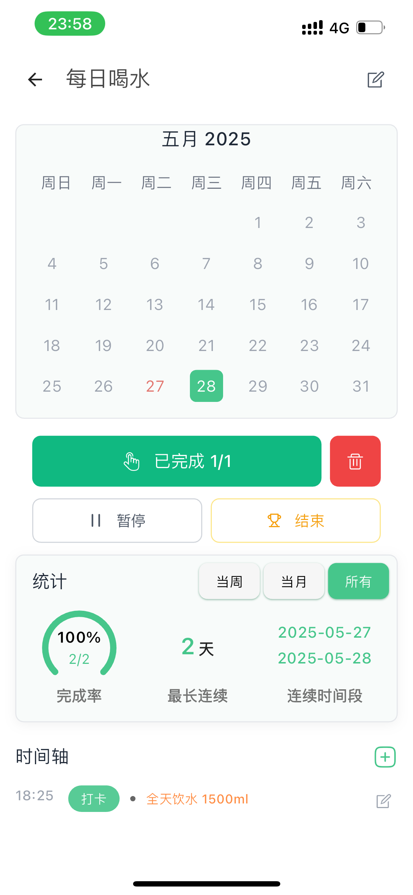

<div align="center">

# LifeHabit - Tiny Habit Builder
### 🌱 Your Science-Based Habit Companion

[](https://apps.apple.com/app/id6473467524)
[](https://play.google.com/store/apps/details?id=com.dxwvv.LifeHabit)
[](https://storage.dxwvv.com/dxwvv-web/LifeHabitApp.apk)
[](https://dxwvv.com/zh-cn)

**Language**: English | [中文](README.md)  
**User Manual**: [📖 English Guide](USER_MANUAL_EN.md) | [📖 中文指南](USER_MANUAL.md)


</div>

---

## 🌟 Introduction

LifeHabit is a science-based habit tracking app that helps you build new habits or break old ones through the power of micro-habits. Our core philosophy is "start small, progress consistently" - making habit formation simple and effective.

---

## ✨ Key Features

### 🎯 **Two-Phase Micro-Habit System**

- **Phase 1**: Set extremely simple goals that are 100% achievable
- **Phase 2**: Gradually increase difficulty while staying in your comfort zone

### 📊 **Data-Driven Habit Building**

- Track habits across three dimensions: time, duration, and frequency
- Smart data analysis helps you find optimal goal setting
- Gradually adjust habit difficulty based on real performance data

### 🎮 **Gamified Motivation System**

- Set rewards for yourself, earn energy through check-ins to redeem
- Over 70 original hand-drawn check-in icons
- Beautiful sharing images make every progress worth celebrating

### 🔔 **Smart Reminder System**

- Multiple reminder methods, no excuses for procrastination
- Desktop widgets: check-ins, rewards, and statistics all in one
- Daily tips: warm encouragement based on scientific guidance

---

## 📱 App Screenshots

<div align="center">

### 🚀 User Journey Overview

<table>
<tr>
<td align="center" width="50%">
<h4>🏠 Home Screen</h4>

<p><em>Clean and intuitive interface with habit progress at a glance</em></p>
</td>
<td align="center" width="50%">
<h4>➕ Create Habits</h4>

<p><em>Easily create new habits with multiple types to choose from</em></p>
</td>
</tr>
</table>

<div style="text-align: center; margin: 20px 0;">
<h3>⬇️ Start Your Habit Journey ⬇️</h3>
</div>

<table>
<tr>
<td align="center" width="50%">
<h4>📊 Habit Details</h4>

<p><em>Detailed statistics make your progress visible</em></p>
</td>
<td align="center" width="50%">
<h4>🎁 Reward System</h4>

<p><em>Gamified motivation to keep you going strong</em></p>
</td>
</tr>
</table>

<div style="text-align: center; margin: 20px 0;">
<h3>🔄 Continuous Experience Optimization 🔄</h3>
</div>

<table>
<tr>
<td align="center" width="50%">
<h4>🔍 Discover</h4>

<p><em>Countless habit templates to discover new possibilities</em></p>
</td>
<td align="center" width="50%">
<h4>👤 Profile</h4>

<p><em>Personalized settings for your unique experience</em></p>
</td>
</tr>
</table>

<br>

### 💡 **Core Feature Flow**

```
                    🌟 LifeHabit Feature Flow 🌟
                              
    🎯 Set Goals ────→ 📝 Create Habits ────→ ⏰ Set Reminders
         │                                        │
         │                                        ↓
    🔄 Optimize ←──── 🎁 Earn Rewards ←──── ✅ Start Tracking
         │                                        │
         │                                        ↓
    📊 Analyze Data ←──────────────────── 📈 View Progress
                              
    ┌──────────────────────────────────────────────────────┐
    │  💪 Daily Persistence → 📊 Data Collection → 🏆 Success  │
    └──────────────────────────────────────────────────────┘
```

<h3>📈 Complete Journey from Micro-Habits to Life Transformation</h3>
<p>🌱 <strong>Micro-Habits</strong> → 📊 <strong>Data Tracking</strong> → 🎮 <strong>Gamification</strong> → 🏆 <strong>Habit Formation</strong></p>

</div>

---

## 🎨 Product Highlights

<div align="center">

<table>
<tr>
<td align="center" width="25%">
<div style="padding: 20px; background: linear-gradient(135deg, #667eea 0%, #764ba2 100%); border-radius: 15px; color: white;">
<h3>🎯</h3>
<h4>Micro-Habit System</h4>
<p>Start with 1%<br/>Progress gradually</p>
</div>
</td>
<td align="center" width="25%">
<div style="padding: 20px; background: linear-gradient(135deg, #f093fb 0%, #f5576c 100%); border-radius: 15px; color: white;">
<h3>📊</h3>
<h4>Data Visualization</h4>
<p>Progress at a glance<br/>Achievement unlocked</p>
</div>
</td>
<td align="center" width="25%">
<div style="padding: 20px; background: linear-gradient(135deg, #4facfe 0%, #00f2fe 100%); border-radius: 15px; color: white;">
<h3>🎮</h3>
<h4>Gamified Rewards</h4>
<p>Earn by checking-in<br/>Make it fun to stick</p>
</div>
</td>
<td align="center" width="25%">
<div style="padding: 20px; background: linear-gradient(135deg, #43e97b 0%, #38f9d7 100%); border-radius: 15px; color: white;">
<h3>🔔</h3>
<h4>Smart Reminders</h4>
<p>Scientific algorithms<br/>Non-intrusive nudges</p>
</div>
</td>
</tr>
</table>

<br>

### ✨ **Why Choose LifeHabit?**

<table>
<tr>
<td align="center" width="33%">
<h3>🧠 Science-Based</h3>
<p>Built on <strong>Fogg Behavior Model</strong><br/>
from behavioral psychology</p>
</td>
<td align="center" width="33%">
<h3>🎨 Beautiful Design</h3>
<p>70+ original hand-drawn icons<br/>
Every detail carefully crafted</p>
</td>
<td align="center" width="33%">
<h3>📈 Continuous Updates</h3>
<p>Team constantly optimizing<br/>
User feedback drives progress</p>
</td>
</tr>
</table>

</div>

---

## 🏆 User Reviews

> **"This is the app that real men should use 🐶"** - LysonOber  
> "So cute! An angel has descended beside me 👼 I really love this positive feedback system of earning energy through check-ins."

> **4.6/5.0** ⭐⭐⭐⭐⭐ - App Store Rating

---

## 🚀 Download Now

<div align="center">

### 📱 Mobile Downloads

<table>
<tr>
<td align="center">
<h3>📱 iOS</h3>
<a href="https://apps.apple.com/app/id6473467524">

</a>
<br>
<code>习惯点点-日常打卡记录与提醒</code>
</td>
<td align="center">
<h3>🤖 Android</h3>
<a href="https://play.google.com/store/apps/details?id=com.dxwvv.LifeHabit">

</a>
<br>
<code>LifeHabit - Tiny Habit Builder</code>
</td>
</tr>
<tr>
<td align="center">
<h3>📦 Direct APK</h3>
<a href="https://storage.dxwvv.com/dxwvv-web/LifeHabitApp.apk">

</a>
<br>
<code>For Android devices</code>
</td>
<td align="center">
<h3>🌐 Website</h3>
<a href="https://dxwvv.com/zh-cn">

</a>
<br>
<code>More info & support</code>
</td>
</tr>
</table>

</div>

---

## 🛠️ Technical Features

- 🎯 **Unlimited habit tracking**
- 📊 **Three-dimensional data analysis**  
- 🔄 **Smart algorithm optimization**
- 📱 **Cross-platform synchronization**
- 🔒 **Data security protection**
- 🎨 **Beautiful UI design**

---

## 📞 Contact Us

<div align="center">

| Contact | Info |
|:---:|:---:|
| 📧 **Email** | support@dxwvv.com |
| 🌐 **Website** | [dxwvv.com](https://dxwvv.com/zh-cn) |

</div>

---

## 📄 Legal Information

- [🔒 Privacy Policy](https://habitdots.com/privacy_policy.html)
- [📋 Terms of Service](https://habitdots.com/user_policy.html#%E8%87%AA%E5%8A%A8%E7%BB%AD%E8%B4%B9)

---

## 📊 User Statistics

<div align="center">

<table>
<tr>
<td align="center" width="25%">
<h2>🎯</h2>
<h3><strong>500+</strong></h3>
<p>Global Downloads</p>
</td>
<td align="center" width="25%">
<h2>⭐</h2>
<h3><strong>4.6/5.0</strong></h3>
<p>App Store Rating</p>
</td>
<td align="center" width="25%">
<h2>👥</h2>
<h3><strong>95%</strong></h3>
<p>User Retention Rate</p>
</td>
<td align="center" width="25%">
<h2>📈</h2>
<h3><strong>21 Days</strong></h3>
<p>Average Habit Formation</p>
</td>
</tr>
</table>

<br>

### 💬 **Real User Testimonials**

<table>
<tr>
<td align="center" width="50%">
<blockquote>
<p><em>"The interface design is amazing! Every check-in gives me a sense of achievement. I've been running for 30 days now!"</em></p>
<cite>— Mike, New York User</cite>
</blockquote>
</td>
<td align="center" width="50%">
<blockquote>
<p><em>"The micro-habit system is truly scientific. Started with 1 push-up daily, now I can do 100!"</em></p>
<cite>— John, California User</cite>
</blockquote>
</td>
</tr>
</table>

</div>

---

<div align="center">

## ⭐ If this project helps you, please give it a star!

**Let's build good habits together and meet a better version of ourselves!**

---

### 🎯 Start Your Habit Journey

[](https://apps.apple.com/app/id6473467524)

---

*Made with ❤️ by LifeHabit Team*  
*Copyright © 2023-2025 LifeHabit. All rights reserved.*

</div> 